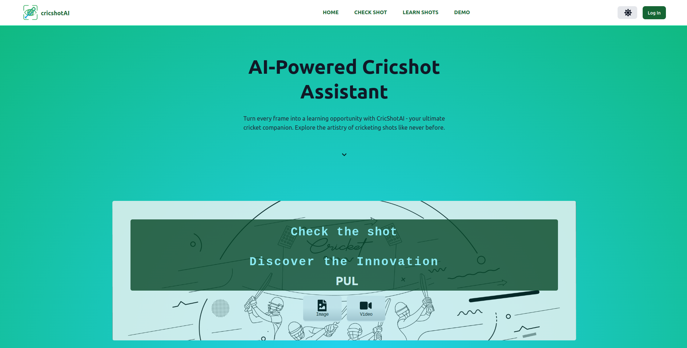

# Cricket PoseNet : AI Shot Assistant

[](https://cricshot-ai.netlify.app)


## Overview

Cricket PoseNet : AI Shot Assistant is a project designed to provide analysis on cricket shots by processing images and videos uploaded by users. The project leverages Deep Learning techniques to deliver real-time cricket shot classification and insights.

It is an AI integrated, Microservices architecture based Full Stack Project.

## Features

- **Frontend**: Use React to create attractive user friendly interfaces.
- **FastAPI**: Integration of FastAPI for machine learning model access.
- **Spring Boot**: Secure user authentication and authorization using Spring Boot.
- **Database**: Data management and storage with MySQL.
- **ML Models**: Deep Learning Models(Yolov8,ANN, CNN,LSTM)


## Installation and Setup Instructions

### Prerequisites

- Python 3.10
- Ffmpeg 6.1
- Java 17.0.10
- Spring Boot 3.22.0
- ReactJS 18.2.0
- MySQL 8.0.22
- Spring Tool Suite(STS)
- Mysql Workbench

### Installation

Clone the repository:

```bash
git clone https://github.com/umair98392/cricshot-AI.git
cd cricshot-AI
```
    
### I. ML Backend

1. Create and activate a virtual environment:
   
    ```bash
    cd ML_BACKEND
    python3 -m venv venv
    source venv/bin/activate  # On Windows use `venv\Scripts\activate`
    ```

3.  Install the required dependencies:
   
    ```bash
    cd backend
    pip install -r requirements.txt
    ```

5. Run the FastAPI application:
   
    ```bash
    uvicorn api.app:app --reload
    ```

- Access the FastAPI documentation at `http://127.0.0.1:8000/docs` to interact with the APIs.
- or check the demo on https://huggingface.co/spaces/Umair98392/lms

### II. Spring Boot Backend for Authentication and Authorization

1. Open Spring Tool Suite(STS)
2. Go to `File > Open Project From File System`
3. select directory folder `CRIC_SHOT_BACKEND/Cric-Shot-backend`
4. click on `finish` to import process.
5. Configure the MySQL Database
   - Create a new database in MySQL:
     
     ```bash
     CREATE DATABASE cricketuser;
     ```
     
6. Application Properties Configuration:
   - Edit the file with your MySQL credentials:
   - Open `src/main/resources/application.properties` :
   - Configure properties like database connection, server port, etc., as needed.

      ```bash
      spring.application.name=Cric-Shot-backend
      spring.datasource.url=jdbc:mysql://localhost:3306/cricketuser
      spring.datasource.username=root
      spring.datasource.password=Root@123
      spring.jpa.hibernate.ddl-auto=update

      logging.level.org.springframework.security=DEBUG
      ```

7. Run the Spring Boot Application:
   - Right-click the project > Run As > Spring Boot App.
   - Verify the application is running by checking the console output. visit http://localhost:8080 in your browser.

8. Connect to Frontend:
   - If your frontend runs on a different port, configure CORS in Spring Boot.
   - Example in @Configuration class:
      ```bash
      @Configuration
      public class WebConfig implements WebMvcConfigurer {
          @Override
          public void addCorsMappings(CorsRegistry registry) {
              registry.addMapping("/**")
                      .allowedOrigins("http://localhost:5173") // Frontend URL
                      .allowedMethods("GET", "POST", "PUT", "DELETE");
          }
      }
      ```

### III. React Frontend

   - Navigate to Frontend Directory
     
     ```bash
      cd CRIC_SHOT_FRONTEND
     ```
     
   - Install Dependencies
     
     ```bash
     npm install
     ```
    
   - Run the Development Server
     
     ```bash
     npm run dev
     ```
     
   - Access the Frontend at `http://localhost:5173` to interact with the APIs.
     
### IV. Deployment

  - Deploy Backend API
    
    - Choose a hosting platform and deploy the FastAPI server.
    - Update the backend URL in the frontend application to match the deployed endpoint.
  
  - Deploy Frontend Application
    
    - Use a static site hosting service or deploy the frontend code to a platform of your choice.

## Files

  - [View the PDF](https://github.com/Umair98392/cricshot-AI/blob/main/RELATED_DOCS/Cricshot_Final_Report.pdf) : Detailed project report.
  - [presentation.ppt](https://github.com/Umair98392/cricshot-AI/blob/main/RELATED_DOCS/Presentation.pptx): Project presentation slides.

## Contributing
Contributions are welcome! Please submit a pull request or open an issue for any enhancements or bug fixes.

Contact us at `umair98392@gmail.com`
